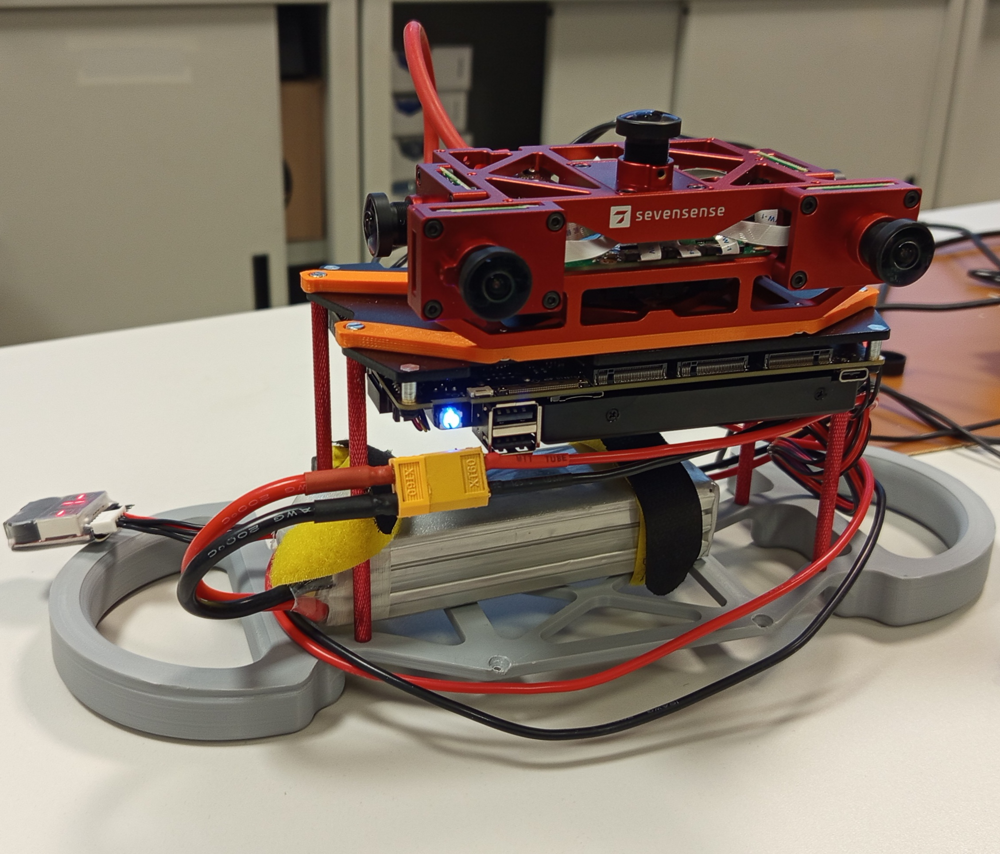
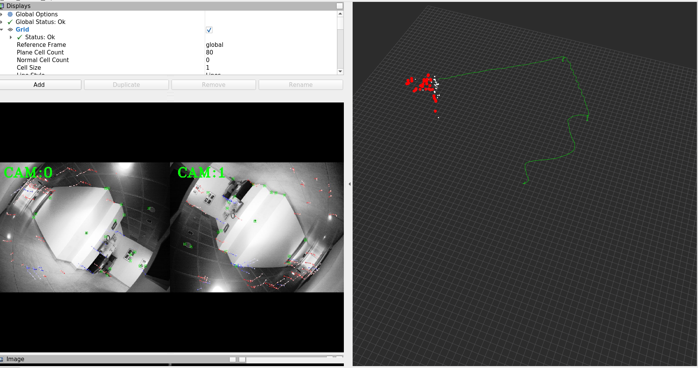
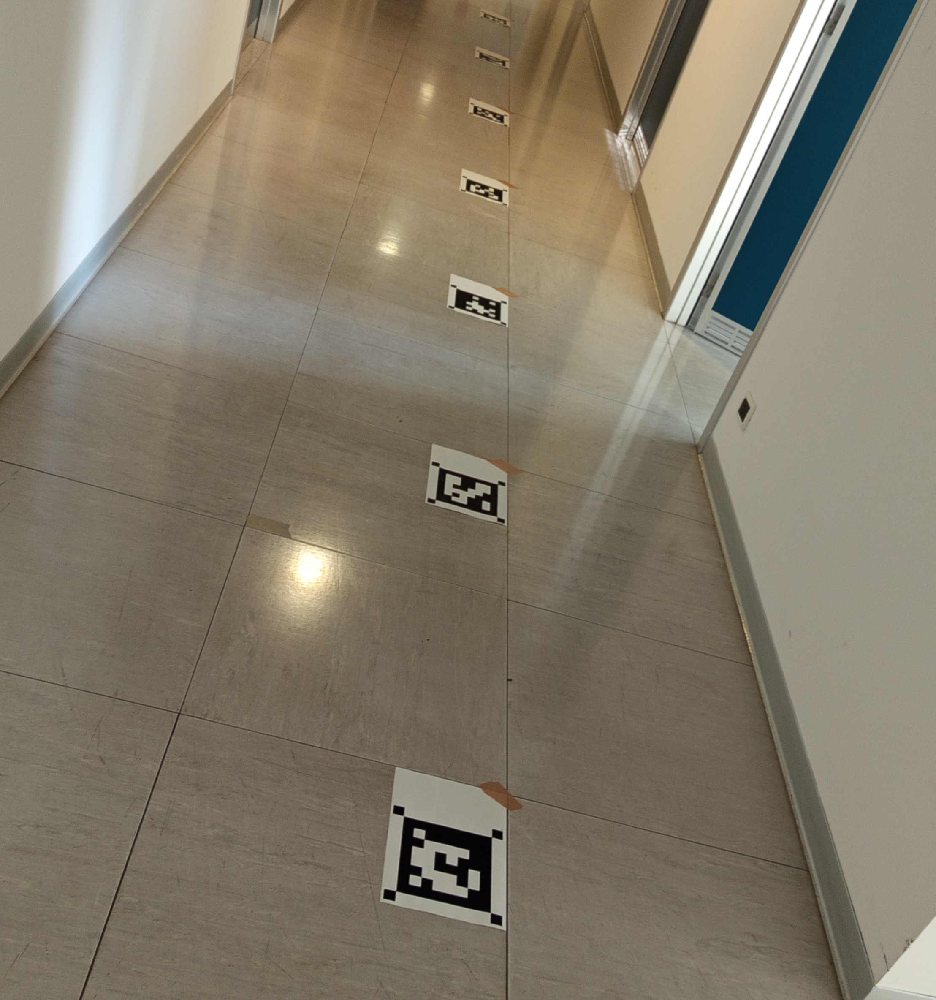
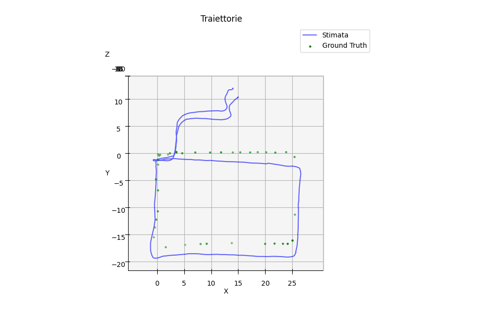

# VIO Multicamera System with OpenVINS  
_Lab Student Project "Autonomous and Intelligent Machines" – PERCRO Lab, Sant'Anna School of Advanced Studies_

---

## Introduction

This project is about a Visual-Inertial Odometry (VIO) system using the open-source framework **OpenVINS** in a multi-camera setup.


The hardware platform used is the **AlphaSense CoreResearch** system, featuring five global shutter cameras and a tightly-synchronized IMU, connected to a **LattePanda Sigma** embedded PC. The software architecture runs inside a Docker container with ROS1 and OpenVINS, adapted to support different multi-camera configurations.


---

## Environment Setup

Follow these steps to set up the development and runtime environment for the OpenVINS multi-camera VIO system.

### 1. Clone This Repository

Start by cloning this repository and building the Docker image:

```bash
git clone https://github.com/gcairone/progettopercro/
cd progettopercro
docker build -t coreresearch:openvins .
```
### 2. Clone OpenVINS

Create the workspace, clone the OpenVINS repository into it:
```bash
mkdir -p ~/progettopercro/catkin_ws_ov/src/
cd ~/progettopercro/catkin_ws_ov/src/
git clone https://github.com/rpng/open_vins/
```
Create a directory to store recorded rosbag files:
```bash
mkdir -p ~/progettopercro/bagfiles/
```
### 4. Launch Docker Container and Build the Workspace

Ensure the container launcher script is executable, then use it to start the Docker container:
```bash
chmod +x run_openvins.sh
./run_openvins.sh
```
Once inside the container, clean and build the OpenVINS workspace:
```bash
catkin clean -y
catkin build 
```


---

## Hardware 

This project is based on the **AlphaSense CoreResearch** multi-camera sensor module and a **LattePanda Sigma** onboard computer. These components are physically connected via an Ethernet cable and powered using a 3S LiPo battery (capable of supplying both devices simultaneously).



### AlphaSense CoreResearch

 Full hardware documentation and specifications are available in the official manual:  
 [https://github.com/sevensense-robotics/core_research_manual](https://github.com/sevensense-robotics/core_research_manual)

Key specifications:

- **Housing**: Aluminum frame (138 × 70 × 44 mm), 260g  
- **Cameras**: 5 × Sony IMX-287 global shutter sensors  
  - Resolution: 0.4 MP (720 × 540), monochrome  
  - Arrangement: 2 front (stereo), 1 left, 1 right, 1 top  
  - Field of View: 165.4° (Diagonal) × 126° (Horizontal) × 92.4° (Vertical)  
- **IMU**: Bosch BMI085 (6-axis MEMS)  
  - Supported frequencies: 100, 200, or 400 Hz  
- **Synchronization**:  
  - Camera-IMU: mid-frame with exposure compensation (<100 μs)  
  - Time sync: PTP (Precision Time Protocol) with host computer  

To verify that the AlphaSense module is correctly connected, you can run the following command from inside the Docker container:

```bash
viewalphasense
```
---

## Use Guide


---


### Record Data
In separate terminals:

1. Start roscore:

```bash
roscore
```
2. Launch the AlphaSense ROS driver:

```bash
rosrun alphasense_driver_ros alphasense_driver_ros
```
3. Start recording to a .bag file:
```bash
rosbag record -O <filename.bag> \
  /alphasense_driver_ros/cam0 \
  /alphasense_driver_ros/cam1 \
  /alphasense_driver_ros/cam2 \
  /alphasense_driver_ros/cam3 \
  /alphasense_driver_ros/cam4 \
  /alphasense_driver_ros/imu
```
### Launch OpenVINS


Launch OpenVINS using the desired configuration:
```bash
source devel/setup.bash 
roslaunch ov_msckf coreresearch_stereo.launch

```
Available launch files:

- coreresearch_stereo.launch: uses the front stereo pair

- coreresearch_3mono.launch: uses the left, right, and top cameras as mono

- coreresearch_complete.launch: uses all five cameras (stereo + mono)

Run the AlphaSense driver:

```bash
rosrun alphasense_driver_ros alphasense_driver_ros 
```
(Optional) Visualize odometry in RViz:

```bash
cd ~/catkin_ws_ov/src/open_vins/ov_msckf/launch
rviz -d display.rviz
```
A minimum jerk is required to trigger proper initialization of the odometry filter.


<!--  
Fare in terminali diversi

Lanciare openVINS con il file che si desidera:
- coreresearch_stereo.launch: Configurazione che usa la coppia di stereo davanti
- coreresearch_3mono.launch: Configurazione che usa le altre 3 camere come mono
- coreresearch_complete.launch: Configurazione che usa coppia stereo + 3 camere mono
```bash
source devel/setup.bash 
roslaunch ov_msckf coreresearch_stereo.launch

```
Lanciare il driver ros dell'HW alphasense
```bash
rosrun alphasense_driver_ros alphasense_driver_ros 
```
Per visualizzare l'odometria:
```bash
cd ~/catkin_ws_ov/src/open_vins/ov_msckf/launch
rviz -d display.rviz
```
Per far partire l'odometria bisogna dare un jerk minimo all'HW.  
-->
### Tracking with Aruco Markers
To generate external reference (ground truth):

- 70 ArUco markers were printed using scripts/generate_aruco_subpixel.py

- They were placed on the floor of the test area (see photo link, to be added)

- A global marker map was built in aruco_map_lab.yaml



Run tracking with:
```bash
python3 scripts/aruco_tracker.py
```

<!-- Sono stati stampati 70 marker aruco, il file usato è stato generato da  scripts/generate_aruco_subpixel.py 

Sono stati attaccati al pavimento come in photo (mettere link a photo)

Si è creata una mappa globale degli aruco nel laboratorio aruco_map_lab.yaml

Si è usato scripts/aruco_tracker.py per ottenere le posizioni di ground truth

-->

### Record Analysis

For post-processing and evaluation, compare estimated trajectory vs. ground-truth using:
```bash
python3 scripts/analysis_aruco_path.py
```
This script computes RMS error and optionally produces visual plots of the trajectory comparison. (Photo example to be added.)


